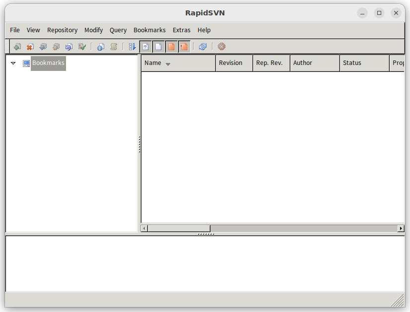

# RapidSVN

GUI client for Subversion
Rapidsvn is a graphical client for the Subversion revision control system (svn) providing an easy to use interface for Subversion features. It aims to be simple for beginners but flexible enough to increase productivity for experienced Subversion users.

## Origin
- [RapidSVN.org](https://rapidsvn.org/)
- [Download 1.12.1](https://rapidsvn.org/download/release/0.12.1/)
- [Debian Package](https://packages.debian.org/search?keywords=rapidsvn)
- [Debian Source](https://packages.debian.org/source/buster/rapidsvn)

## DEB, RPM and TGZ
- [PKGS](https://pkgs.org/download/rapidsvn)

## Snap
- [RapidSVN-Snap](https://snapcraft.io/install/rapidsvn-snap)

### Snap Credit
- Snap Sponsor - Projektbox GmbH, Oliver Arnold
- Snap Maintainer - Ko Ko Ye

## Source
- [Github](https://github.com/RapidSVN/RapidSVN)
- [Snapcraft](https://github.com/kokoye2007/rapidsvn-snap)

